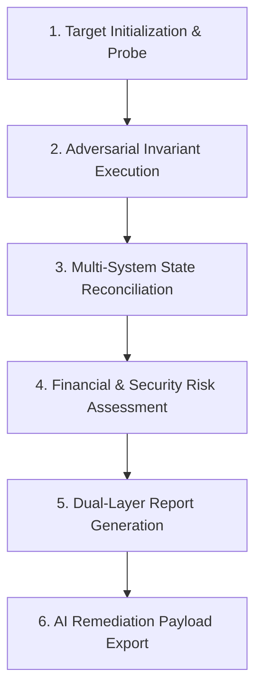

# 00 — Acid-test Master Architecture & Systems Specification

## 1. System Mission & Core Paradigm
`Acid-test` is an adversarial backend reliability, security, and chaos-testing suite designed to audit distributed web applications, databases, payment gateways, and asynchronous pipelines against the universal laws of **Atomicity**, **Consistency**, **Isolation**, and **Durability (ACID)**.

It is built for two distinct audiences:
1. **Non-Technical Founders & Business Owners:** Outputs human-readable risk assessments, plain-English root causes, estimated financial loss calculations, and simple pass/fail health grades.
2. **Senior Engineers & AI Coding Agents:** Outputs exact microsecond reproduction bursts, failing SQL query traces, diff trees, and structured JSON payloads ready for automated AI remediation.

---

## 2. Monorepo Topology & Package Boundaries

The project is structured as a TypeScript monorepo managed with **pnpm workspaces** and **Turborepo**:

```
acid-test/
├── package.json                   -> Root workspace metadata & scripts
├── pnpm-workspace.yaml            -> Workspace package boundaries
├── turbo.json                     -> Build & test pipeline cache
├── specs/                         -> Complete architectural specification suite
│
├── packages/
│   ├── cli/                       -> @acid-test/cli (Global terminal entrypoint)
│   ├── core/                      -> @acid-test/core (Logging, crypto, assertions, runner harness)
│   ├── billing/                   -> @acid-test/billing (Stripe, LemonSqueezy, Paddle, Shopify engine)
│   ├── db/                        -> @acid-test/db (PostgreSQL, Supabase, RLS, SQL AST auditor)
│   ├── auth/                      -> @acid-test/auth (Clerk, Supabase Auth, NextAuth penetration)
│   ├── queue/                     -> @acid-test/queue (BullMQ, Redis, SQS chaos engine)
│   ├── webhook/                   -> @acid-test/webhook (Ingress, raw-buffer, HMAC re-signer)
│   ├── ai/                        -> @acid-test/ai (OpenAI, Anthropic SSE, schema drift guard)
│   ├── email/                     -> @acid-test/email (Resend, Postmark delivery & template lint)
│   └── storage/                   -> @acid-test/storage (S3, Cloudflare R2 presigned token auditor)
│
└── apps/
    └── studio/                    -> @acid-test/studio (Local visual web UI on localhost:4400)
```

---

## 3. Core Execution Lifecycle

Every execution of `npx @acid-test/cli <module> [flags]` follows a strict 6-stage lifecycle:



### Stage 1: Target Initialization & Probe
- Verifies target connectivity (HTTP endpoint, Database connection string, or Redis URI).
- Performs a pre-flight probe: checks CORS headers, latency baseline, server software signatures, and schema accessibility.

### Stage 2: Adversarial Invariant Execution
- Executes module-specific non-happy-path tests (e.g. 10 concurrent requests within 5ms, manipulated timestamps, malformed JSON bodies, expired cryptographic headers, role impersonation).

### Stage 3: Multi-System State Reconciliation
- Queries the secondary state store (e.g. compares Stripe's real cloud ledger against the target app's PostgreSQL database) to detect silent state drift or phantom records.

### Stage 4: Financial & Security Risk Assessment
- Classifies discovered failures into 4 severity tiers:
  - `CRITICAL`: Direct financial loss (double credits), cross-tenant data leaks, or unhandled crashes.
  - `HIGH`: Broken webhook signature validation, unindexed queries on large tables, or missing transaction rollbacks.
  - `MEDIUM`: Missing idempotency keys, unhandled 429 retries, or template variable fallbacks.
  - `LOW`: Minor header discrepancies or non-standard error codes.
- Calculates an **Estimated Financial Risk Exposure ($/mo)** based on estimated transaction volume and failure frequency.

### Stage 5: Dual-Layer Report Generation
- Prints an interactive terminal report (colored progress spinners, summary cards, and risk badges).
- Generates a standalone, styled HTML audit report (`.acid-test/reports/audit-[timestamp].html`) and Markdown summary.

### Stage 6: AI Remediation Payload Export
- Generates `.acid-test/remediation.json` and a formatted prompt ready to pipe directly into Cursor, Claude Code, or Antigravity to fix the discovered code defects.

---

## 4. Universal Exit Codes & CI/CD Integration

The CLI enforces standard exit codes for automated CI/CD pipelines:

* `0`: Clean audit. All ACID invariants satisfied, 0 Critical/High issues.
* `1`: Critical/High ACID violation detected (e.g. race condition double-credit, RLS data leak).
* `2`: Target configuration error (invalid database URI, unreachable endpoint, bad credentials).
* `130`: Process interrupted by user (SIGINT/Ctrl+C).
